# CryptoApp

A CrytoApp projektet nyáron készítettem, a feladatot az ICB Tech gyakorló feladatként, továbbtanulási lehetőségként bízta rám, amit leadás után át is néztek.

A cél egy Flutter alkalmazás elkészítése volt amivel kriptovalutákat követhetjük. A kriptovaluta adatokhoz a Nomics API volt használva - https://nomics.com/docs/ , a közelgő eseményekhez pedig a Coin Gecko API - https://api.coingecko.com/api/v3/events?upcoming_events_only=true

Minden regisztrált telefonszámmal egy új felhasználó jön létre, a felhasználónak tárolódnak a kedvenc kriptovalutái.

Az alkalmazás két részből áll, Firebase backendből és Flutter alkalmazásból.

Az alkalmazás alap követelményei:

* Firebase Phone Auth implementálása
* Engedélyek kezelése
* Sikertelen kérések kezelése
* Hálózati hibák kezelése
* Pagináció használata
* Bloc state management alkalmazása
* Az alkalmazásnak legyen legalább két nyelve (pl. angol, magyar)
* Gitlab repository használata, master és develop branchekkel

# Alkalmazás müködése

Az alkalmazás első indítására egy Onboarding képernyő jelenik meg, ami bemutatja a felhasználónak az alkalmazás főbb funkciójait.

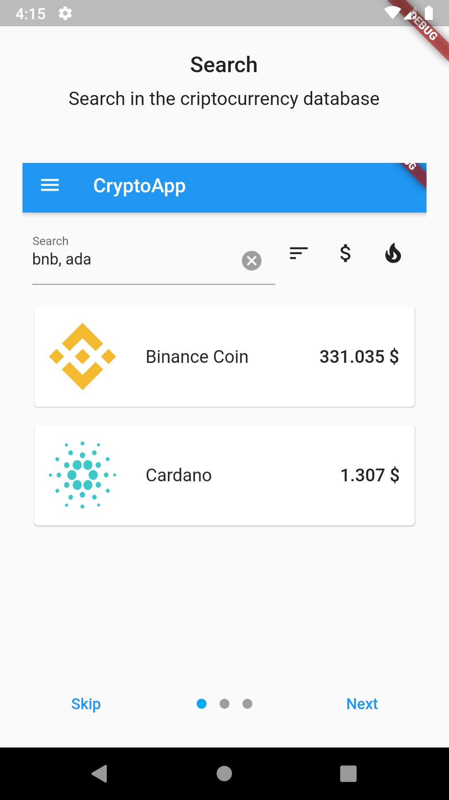

Majd ezután az Authentikációs képernyőre kerülünk. Az alkalmazásba mobiltelefonszámmal lehet belépni. A szám megadása után üzenetben érkeznie kell egy üzenetnek, az üzenetben szereplő kódot kell beírnunk.

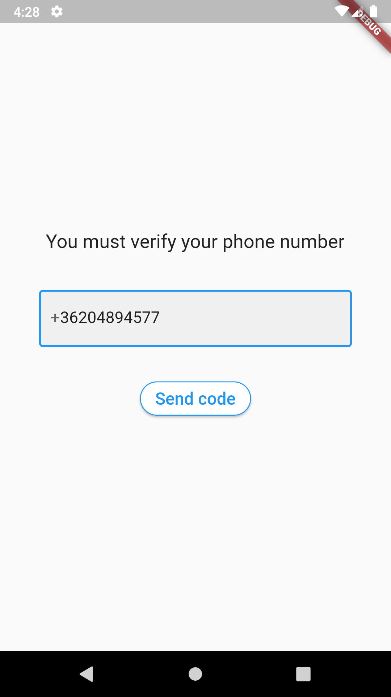 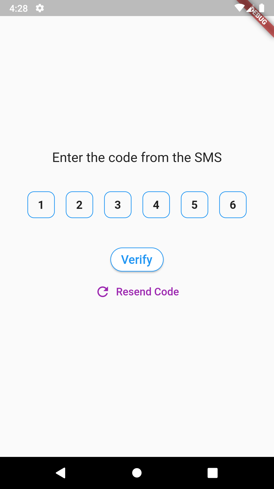

Sikeres bejelentkezés után a kezdőképernyő fogadja a felhasználót. A kezdőképernyőn a legnépszerűbb kriptovaluták alapján listázza a valutákat. A lista az nagyon hosszú, ezért pagináció van alkalmazva a jobb teljesítmény érdekében.

Keresésre is van lehetőség az adatbázisban, a szövegmezőbe beírva a kriptovaluta id-jét. Egyszerre több valutára való keresés is lehetséges, vesszővel kell elválasztani ilyenkor az id-ket.

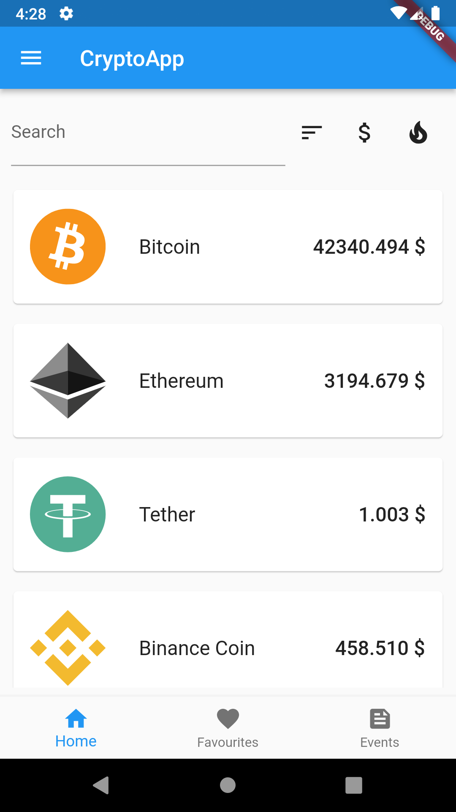 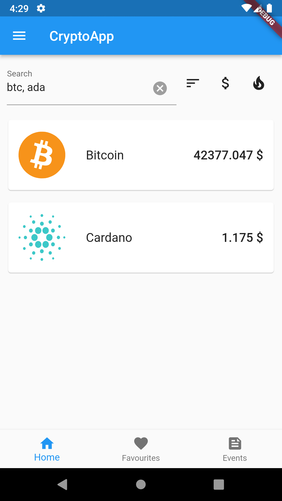

A kritpovalutára rákoppintva átkerülünk arra az oldalra, ahol részletesebb információkat tekinthetünk meg. A jobb felső sarokva a szivecskére koppintva kedvencekké tehetjuk vagy törölhetjük a kedvenceink közül

Az ár változásokat egy diagram segítségével elemezheti a felhasználó. Rákoppintva a diagramra lehet megnézni adott intervallum értékét. 

Az árakat feltüntethetjük euróban és dollárban, illetve több intervallum is rendelkezésre áll a felhasználó számára (24 óra, 7 nap, 30 nap, 365 nap, adott kezdetétől számítva)

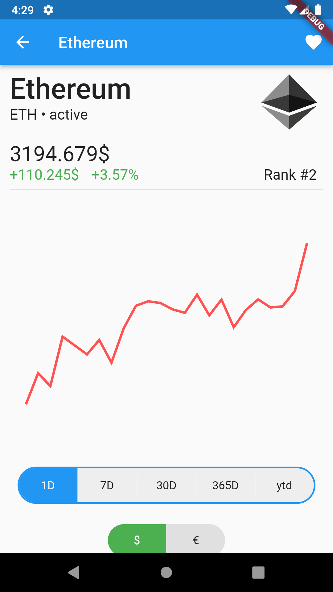 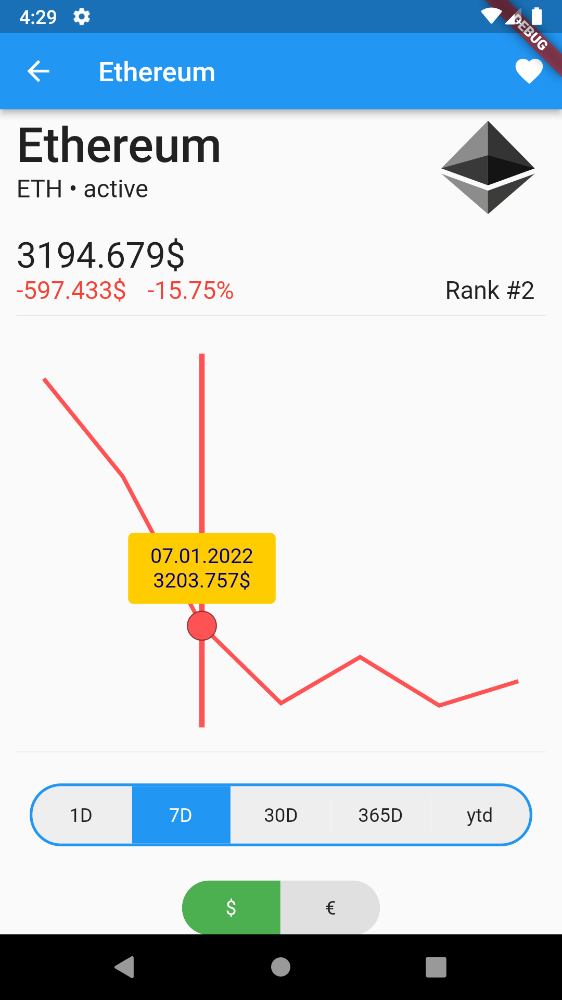 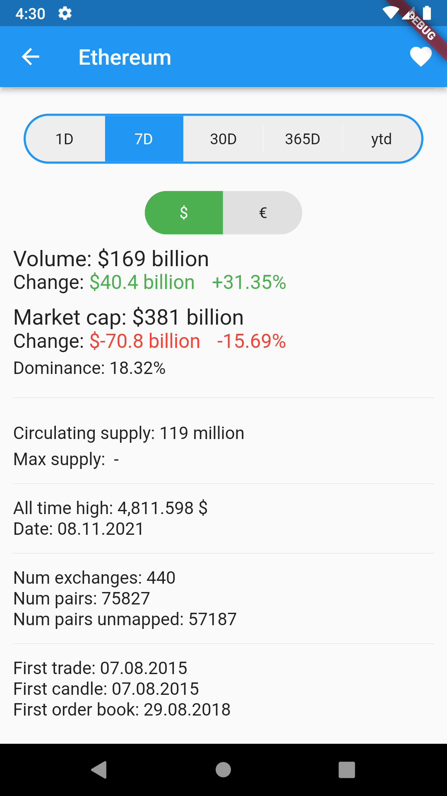

A kedvencek fülön a felhasználó kedvenc kritpovalutái listázódnak ki, az események fülön pedig a közelgő kriptovalutás események jelennek meg. A dokumentáció készítése során nem volt közelgő esemény, ezért annak a müködését nem tudom megmutatni.

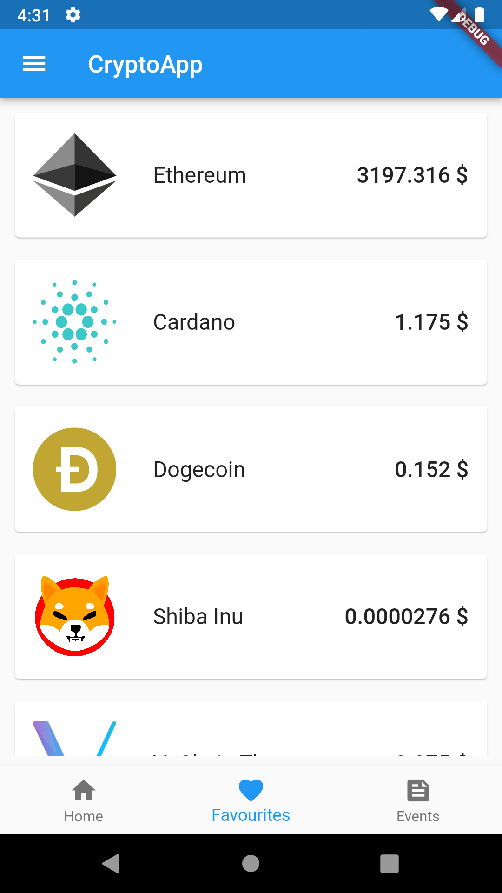 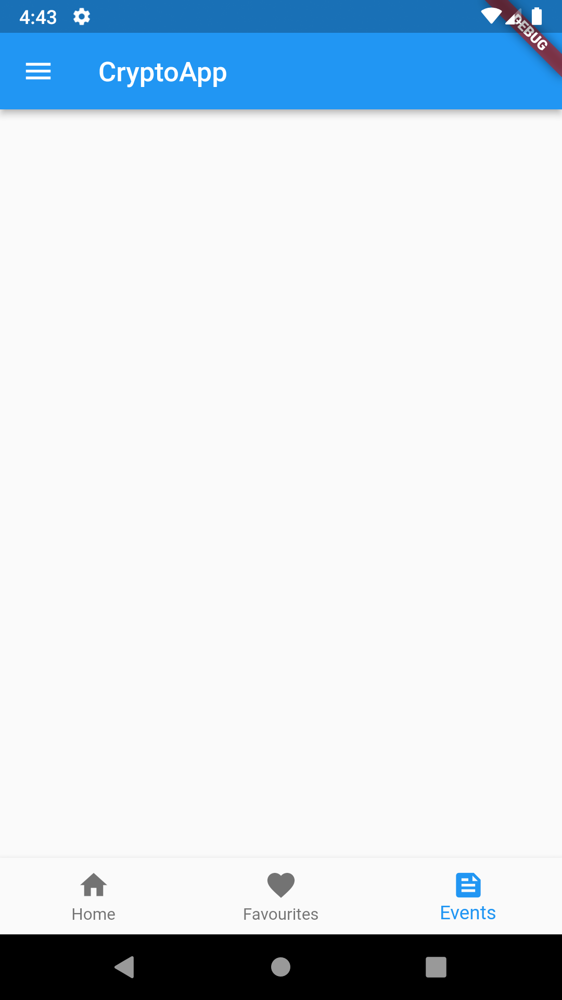

Az alkalmazás Drawer-jában az adott felhasználó telefonszáma található meg, illetve itt van opció nyelv váltásra és a kijelentkezésre.

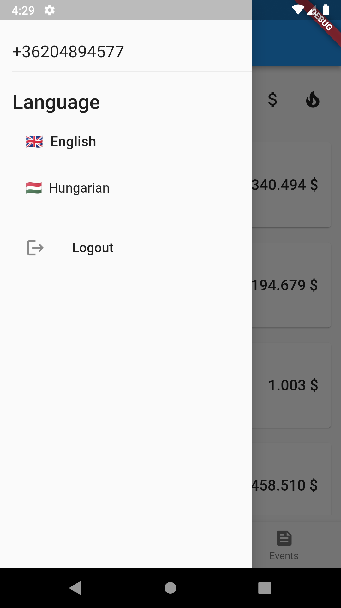 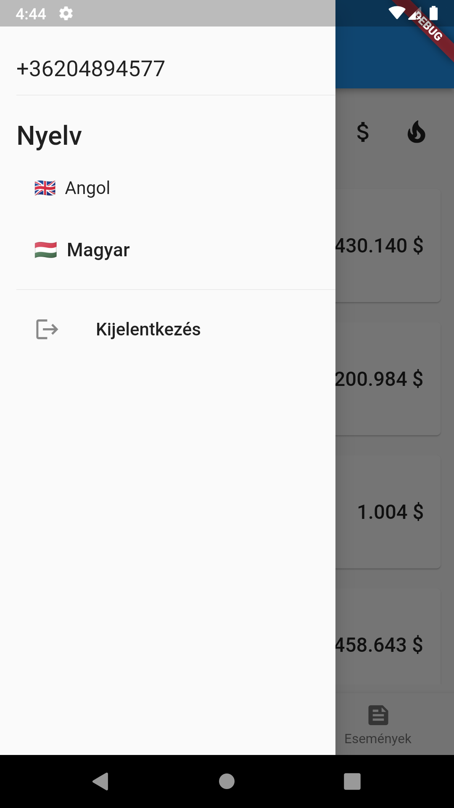
